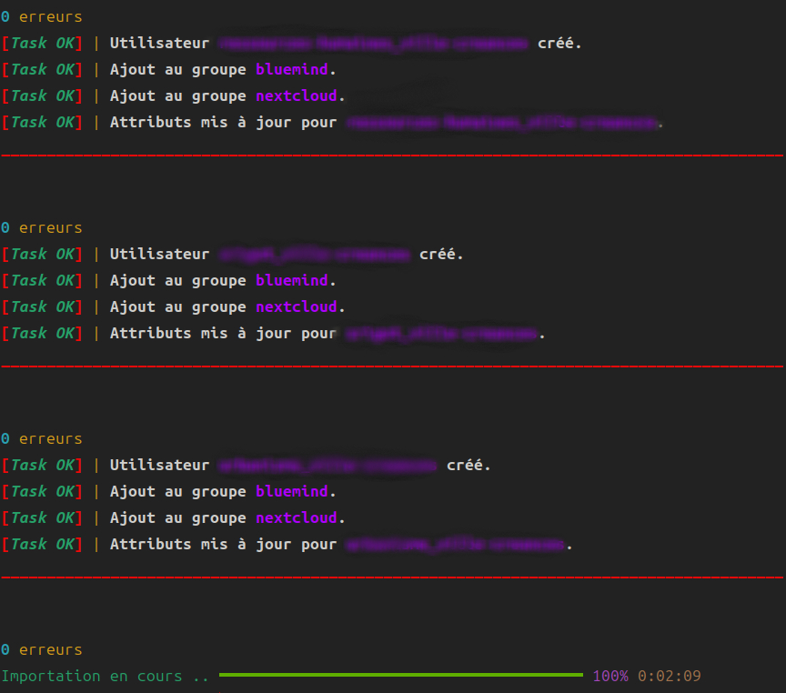

# Importateur Samba-AD

Script Python permettant d'importer des structures (OU, Groupes, Utilisateurs) depuis un export JSON (ex: OpenLDAP) vers un Active Directory Samba 4.

## Pré-requis
* Python 3
* Librairies : `samba`, `rich`

## Utilisation

python3 samba_ad_importer.py "sample_data.json"
